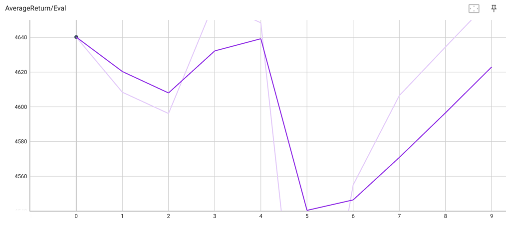
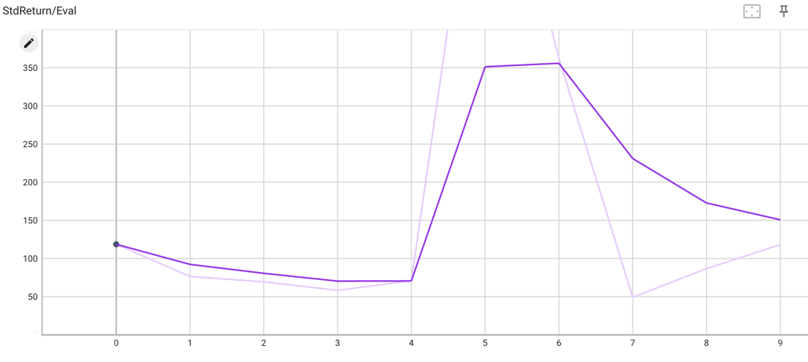
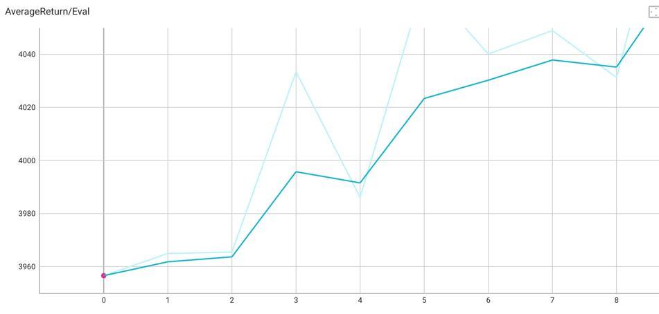
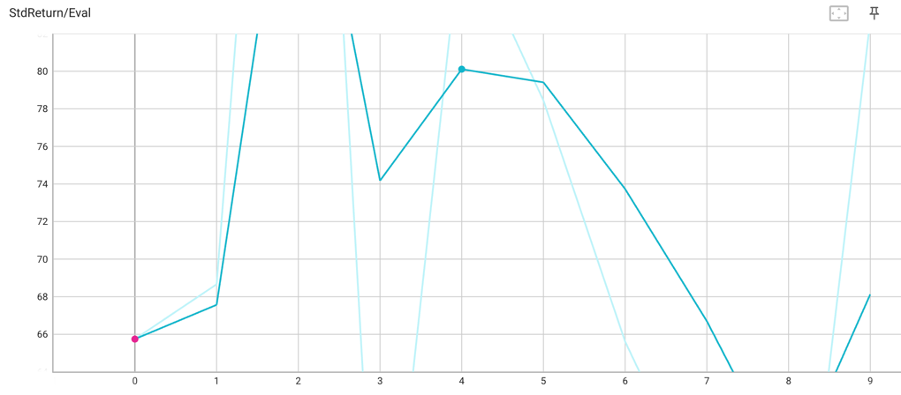
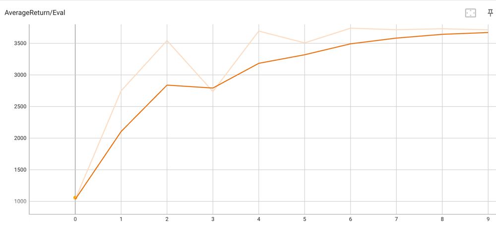
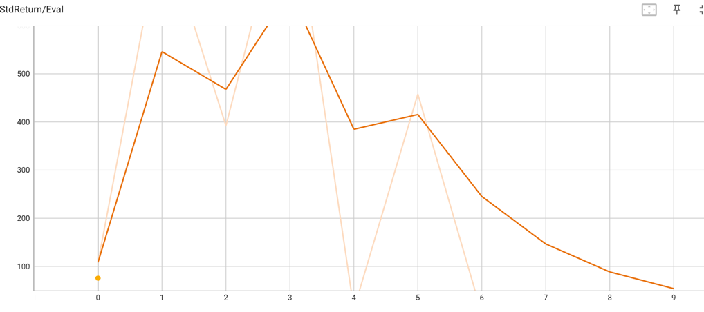
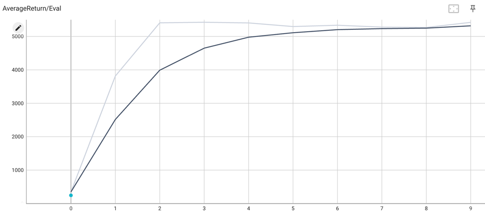
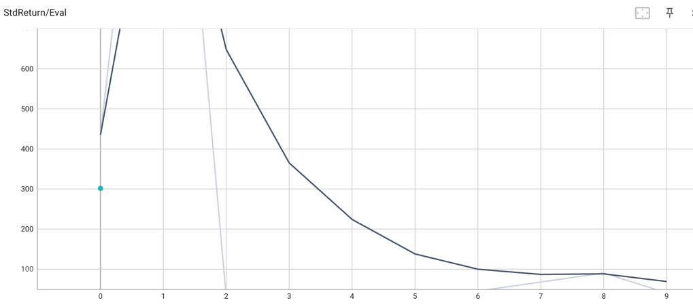

## Behavioral Cloning

| env            | return mean vs expert mean | return std vs expert std | eval_batch_size |
|----------------|----------------------------|--------------------------|-----------------|
| ant-v4         | 4640  vs. 4682             | 118.60 vs. 30.71         | 5000            |
| halfcheetah-v4 | 3957  vs. 4035             | 65.75  vs. 32.87         | 5000            |
| hoppper-v4     | 1060  vs. 3718             | 75.49  vs. 0.35          | 2000            |
| walker2d-v4    | 244.7 vs. 5383             | 301.5  vs. 54.15         | 2000            |

## DAgger

10 iterations. 
eval_batch_size 5000.

### ant-v4 return mean and std

### HalfCheetah return mean and std

### Hopper-v4 return mean and std

### Walker-4 return mean and std

